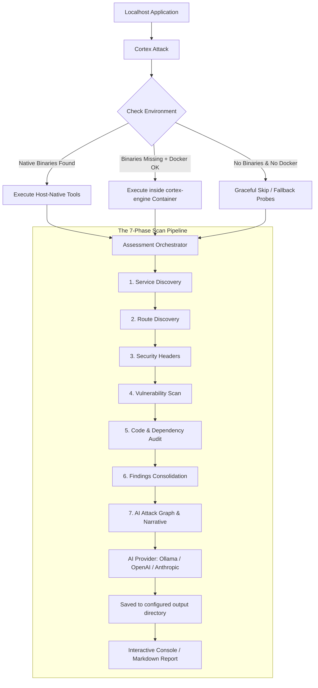

<p align="center">
  
</p>

<p align="center" style="color: #8f8f8f">
  <a href="https://cortex-edr.com">Website</a> •
  <a href="https://linkedin.com/company/cortex-edr">LinkedIn</a> •
  <a href="https://instagram.com/cortex_edr">Instagram</a> •
  <a href="https://github.com/Cortex-EDR">GitHub</a>
</p>

# Cortex Attack

[](https://www.npmjs.com/package/cortex-attack)
[](https://nodejs.org)
[](LICENSE)
[](https://www.docker.com)
[](https://ollama.com)

Cortex Attack is a terminal-native, open-source security intelligence and attack orchestration engine built for developers. It automatically scans your local applications, identifies security configuration issues, maps multi-hop attack graphs, and writes code-level remediation patches using local or cloud-based artificial intelligence.

Featuring a zero-configuration architecture, Cortex Attack coordinates industry-standard scanners on your host. If a scanning tool is missing from your system, Cortex Attack transparently routes execution through an ephemeral Docker fallback environment.


---

## How Cortex Protects You

Cortex Attack secures applications by converting disorganized vulnerability warnings into cohesive, threat-modeled context. It operates strictly inside a localized safety boundary, providing key protection benefits:

* Local safety boundary: Cortex Attack restricts all scanning and network analysis to localhost, 127.0.0.1, and loopback ranges. It never issues intrusive requests to remote staging or production environments.
* Non-destructive audits: Scans are strictly passive. Cortex Attack does not attempt database writes, brute-forcing, or data mutation.
* Local intelligence: By defaulting to local Ollama models, your application routes, package manifests, and server settings are analyzed entirely on your device, ensuring no proprietary code is uploaded to external clouds.
* Exploit path analysis: Rather than leaving you with isolated findings, Cortex Attack uses AI to trace how minor issues (like an exposed development route combined with an outdated package version) can form an actionable exploit chain.
* Patches: Every identified risk includes deep developer explanations and drop-in code patches to immediately resolve the weakness.

---

## Key Features

* Zero-configuration fallback: Automatically executes scanners natively on your host. If they are absent, it routes their execution inside the cortex-engine container.
* Multi-engine support: Harnesses the combined capabilities of nmap, nikto, semgrep, trivy, whatweb, and curl.
* Local-first AI: Defaults to Ollama (llama3.2) for completely free and offline security analysis. Supports OpenAI and Anthropic API connections.
* Interactive walkthroughs: Review finding histories, explore scan execution timelines, and query the AI directly in the console for remediation steps.
* Comprehensive report exports: Generates high-quality Markdown reports compiling endpoints, discovered software, vulnerabilities, code audits, and attack graphs.

---

## Execution Pipeline

Cortex Attack runs its assessments through a structured 7-phase security pipeline:



---

## Installation Guide

Cortex Attack requires Node.js >= 18.0.0.

### 1. Global Package Installation

Install the package globally via npm:

```bash
npm install -g cortex-attack
```

### 2. Scanner Host Installation

Cortex Attack will run natively if the tools are found on your system path. Install them using your system package manager:

#### macOS (via Homebrew)
```bash
brew install nmap
brew install nikto
brew install aquasecurity/trivy/trivy
brew install semgrep
brew install whatweb
```

#### Linux (Debian/Ubuntu-based)
```bash
sudo apt update
sudo apt install -y nmap nikto curl whatweb python3-pip

# Add Aqua Security repository for Trivy
sudo apt install -y apt-transport-https gnupg lsb-release
wget -qO - https://aquasecurity.github.io/trivy-repo/deb/public.key | gpg --dearmor | sudo tee /usr/share/keyrings/trivy.gpg > /dev/null
echo "deb [signed-by=/usr/share/keyrings/trivy.gpg] https://aquasecurity.github.io/trivy-repo/deb $(lsb_release -sc) main" | sudo tee /etc/apt/sources.list.d/trivy.list
sudo apt update
sudo apt install -y trivy

# Install Semgrep
pip3 install semgrep
```

#### Windows
To use these tools natively on Windows, install them via Chocolatey:
```powershell
choco install nmap
pip install semgrep
```
Due to the complexity of compiling and running Linux-native scanners on Windows, Windows users are strongly encouraged to use the Docker fallback method.

### 3. Docker Fallback Setup (Alternative)

If you do not want to install individual security tools locally, you can use the Docker fallback engine. If a scanner is missing, Cortex Attack executes it within an isolated Docker container.

1. Install and start Docker Desktop (Windows/macOS) or Docker Engine (Linux).
2. Ensure your user has permissions to interact with the Docker daemon:
   ```bash
   docker ps
   ```
3. Cortex Attack will handle container image pulling and configuration transparently.

---

## Quick Start

### 1. Check your Environment
```bash
cortex doctor
```

### 2. Start an Assessment
Audit a web application running on port 3000, passing the project directory for static code analysis:
```bash
cortex attack localhost:3000 --cwd ./my-project
```

### 3. Explore previous assessments
List all recorded scan sessions:
```bash
cortex sessions
```

### 4. Inspect scan timelines
Show tool executions, durations, and exit statuses for a specific run:
```bash
cortex timeline --session session_84247440
```

### 5. Consult the AI
Request a detailed explanation and code patch for a finding:
```bash
cortex explain --finding NK-A39B2 --session session_84247440
```

### 6. Export the report
Write a full Markdown report to disk:
```bash
cortex report --session session_84247440 --output ./report.md
```

---

## Command Reference

### cortex attack [target]

Runs a non-destructive passive security assessment against the specified local address.

```
Arguments:
  target                      Localhost address to assess (e.g., localhost:3000)

Options:
  --cwd <path>                Path to codebase for static audits (semgrep/trivy)
  --verbose                   Prints all underlying tool output streams to terminal
  --ai <provider>             Override default AI provider (ollama, openai, anthropic)
  --model <name>              Override default model name
  --key <apiKey>              API key override for openai/anthropic
  --artifacts-dir <path>      Directory to write session findings and reports
  -h, --help                  display help for command
```

### cortex config

Manages the global configuration file saved at `~/.cortex/config.json`.

```
Options:
  --set-key <key>             Save API key for OpenAI or Anthropic providers
  --set-ai <provider>         Set default AI provider (ollama, openai, anthropic)
  --set-model <model>         Set default model name (e.g., llama3.2, gpt-4o)
  --set-artifacts-dir <path>  Set custom local directory to save artifacts
  --set-session-dir <path>    Set custom local directory to save artifacts (alias)
  --show                      Display current configured parameters and keys
  -h, --help                  display help for command
```

### cortex doctor

Performs a diagnostic check of host dependencies, checking for local tool installations, Docker connectivity, and AI provider reachability.

### cortex explain

Generates code-level context and remediation instructions for a finding.

```
Options:
  --finding <id>              The specific finding ID to explain
  --session <id>              Session ID where the finding was recorded
  --ai <provider>             Override default AI provider
  --model <name>              Override default model name
  --key <apiKey>              API key override
  -h, --help                  display help for command
```

### cortex report

Generates a formatted Markdown report.

```
Options:
  --session <id>              Target session ID (defaults to latest session)
  --output <file>             Output filepath (defaults to report.md)
  -h, --help                  display help for command
```

### cortex sessions

Lists all historical scan sessions stored locally, showing target host details and timestamps.

### cortex timeline

Retrieves a detailed chronological timeline showing executed CLI commands, run durations, and exit codes for a session.

---

## Capabilities and Model Comparison

Cortex Attack matches different scanning tools and AI platforms depending on the depth required. 

### Visualizers and Reports

Interactive visualizers comparing models and capabilities are available in the repository. Open them in a web browser to review findings, chart measurements, and performance logs:
* [Cortex Capabilities Visualizer](assets/cortex_capabilities_visual.html)
* [Cortex Model Comparison Radar](assets/cortex_model_comparison.html)

### Scan Phase Performance and Coverage

Below is the execution coverage and tool mapping per scan phase:

| Phase | Description | Underneath Tools | Target Coverage |
|---|---|---|---|
| 1. Service Discovery | Port, technology, and stack identification | nmap, curl, whatweb | 95% |
| 2. Route Discovery | Crawling public endpoints and routes | cortex crawler (46 paths) | 60% |
| 3. Header Analysis | Verifying missing HSTS, CORS, and security flags | curl (3 endpoints) | 100% |
| 4. Web Vuln Scan | Server misconfiguration scanning | nikto (docker-based) | 70% |
| 5. Dependency Audit | Package manifest security audits | semgrep, trivy | 55% |
| 6. Attack Graphs | Modeling vulnerability chains | AI reasoning engine | 80% |
| 7. Narrative | Contextual descriptions and patches | AI reasoning engine | 90% |

### AI Model Suitability Comparison

Cortex Attack supports several local and cloud-based models. Review their performance metrics below:

| Model | Overall Score (0-10) | Cost per Scan | Tier | Key Capabilities / Limitations |
|---|---|---|---|---|
| tinyllama | 1.2 | Free | Unusable | Fastest response, but echoes input, fails JSON schemas, and hallucinates context. |
| qwen2.5-coder:1.5b | 4.4 | Free | Partial | Fast local execution, builds partial graphs, uses pipe-separated values, 1.5B parameters. |
| llama3.2 | 5.8 | Free | Recommended | Recommended local default. Solid descriptions, but struggles with strict JSON schemas. 2GB footprint. |
| gpt-4o-mini | 7.4 | ~$0.001 | Best Value | Recommended cloud model. Generates valid JSON, clean graphs, and clear descriptions. |
| gpt-4o | 8.2 | ~$0.01 | Solid | Robust framework-aware insights, valid JSON schemas, and highly coherent narratives. |
| gpt-5.5 | 7.6 | ~$0.10 | Best Reasoning | Deepest architectural reasoning, Next.js context-aware, senior developer tone, but slower response times. |

---

## Local Development

If you wish to build or test Cortex Attack locally:

```bash
# Clone the repository
git clone https://github.com/Cortex-EDR/cortex-attack.git
cd cortex-cli

# Install dependency packages
npm install

# Compile the TypeScript files (outputs to dist/)
npm run build

# Run local development commands directly
npm run dev -- attack localhost:3000
```

---

## Repository Metrics

* Software License: MIT
* Target Audience: Software Engineers and Security Professionals
* Project Scope: Passive recon, static analysis, threat path generation

---

Distributed under the MIT License. See `LICENSE` for details.
